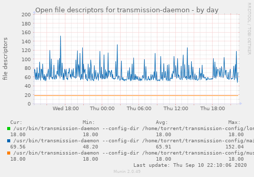

# Munin plugin for monitoring number of open file descriptors

## Project status

This plugin is used daily on a couple of machines and causes no headaches.
Tested on Debian Stable, other setups should work fine but were not tried yet.


## Overview

This plugin tracks number of open files for all processes of the specified
program. Each process is represented by its own line in the chart.




## Installation and usage

To install this plugin you need to copy/symlink [fdcount.py](fdcount.py) to
Munin's plugin directory (usually `/etc/munin/plugins/`) and make that file
executable (`chmod +x`).

This plugin MUST be configured before use:
- `env.fdcount_target` - executable name for processes to monitor
  (required)
- `env.fdcount_strict` - if this variable is set, `env.fdcount_target` must
  contain full executable path instead of just the filename
- `env.fdcount_track_pids` - if this variable is set, processes will be
  distinguished based on their PID instead of just command line
- `user` - either `root` or the user that started the processes in
  question

More information on installation and configuration of plugins is available in
the [Munin Guide](http://guide.munin-monitoring.org/en/latest/plugin/use.html)


## Configuration example (`/etc/munin/plugin-conf.d/fdcount`)

Short version with just the filename:

```
[fdcount.py]
env.fdcount_target transmission-daemon
user root
```

More specific target:

```
[fdcount.py]
env.fdcount_target /usr/bin/transmission-daemon
env.fdcount_strict 1
user transmission
```


## Support and contributing

If you need help with using this plugin please create [**an
issue**](https://github.com/sio/munin_plugin_fdcount/issues). Issues are also
the primary venue for reporting bugs and posting feature requests. General
discussion related to this project is also acceptable and very welcome!

In case you wish to contribute code or documentation, feel free to open [**a
pull request**](https://github.com/sio/munin_plugin_fdcount/pulls). That would
certainly make my day!

I'm open to dialog and I promise to behave responsibly and treat all
contributors with respect. Please try to do the same, and treat others the way
you want to be treated.

If for some reason you'd rather not use the issue tracker, contacting me via
email is OK too. Please use a descriptive subject line to enhance visibility
of your message. Also please keep in mind that public discussion channels are
preferable because that way many other people may benefit from reading past
conversations. My email is visible under the GitHub profile and in the commit
log.


## License and copyright

Copyright 2019 Vitaly Potyarkin

    Licensed under the Apache License, Version 2.0 (the "License");
    you may not use this file except in compliance with the License.
    You may obtain a copy of the License at

        http://www.apache.org/licenses/LICENSE-2.0

    Unless required by applicable law or agreed to in writing, software
    distributed under the License is distributed on an "AS IS" BASIS,
    WITHOUT WARRANTIES OR CONDITIONS OF ANY KIND, either express or implied.
    See the License for the specific language governing permissions and
    limitations under the License.
